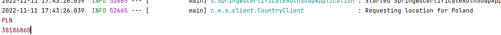

# Notes
*This project doesnt require key generation and classes generation from xsd*

## To run and test it follow steps below

**1. create two directories *client* and *server***

**2. clone the repo in both directories**

**3. first start the server, if you are using idea choose profile server from edit configurations**

server runs on port 8090

**4. now start the client, choose profile client**

client runs on port 8081

this is the expected output